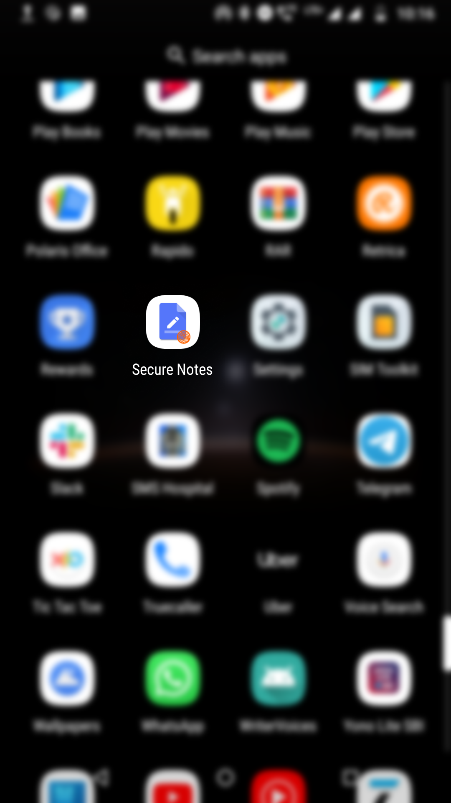
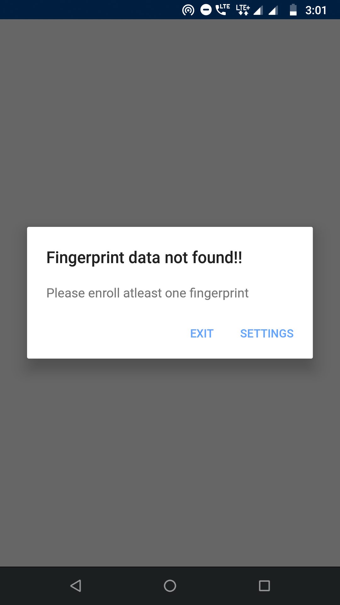
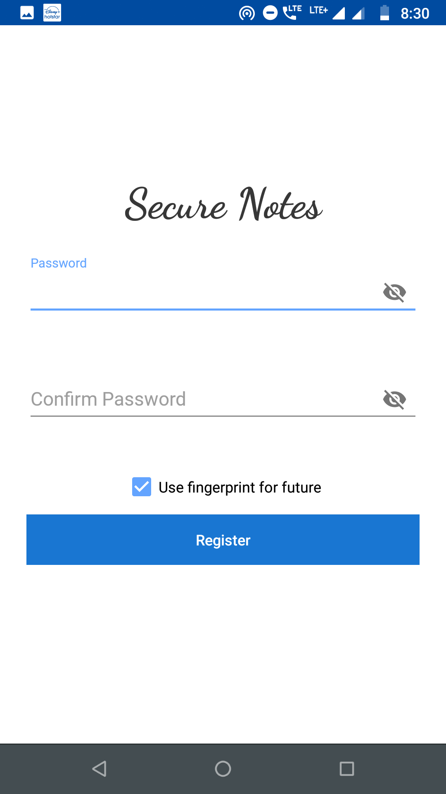
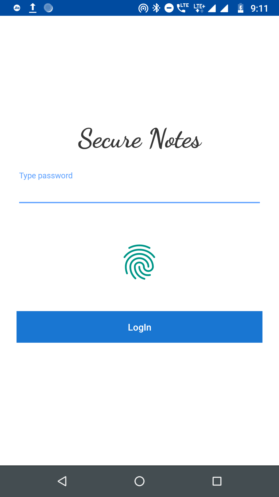
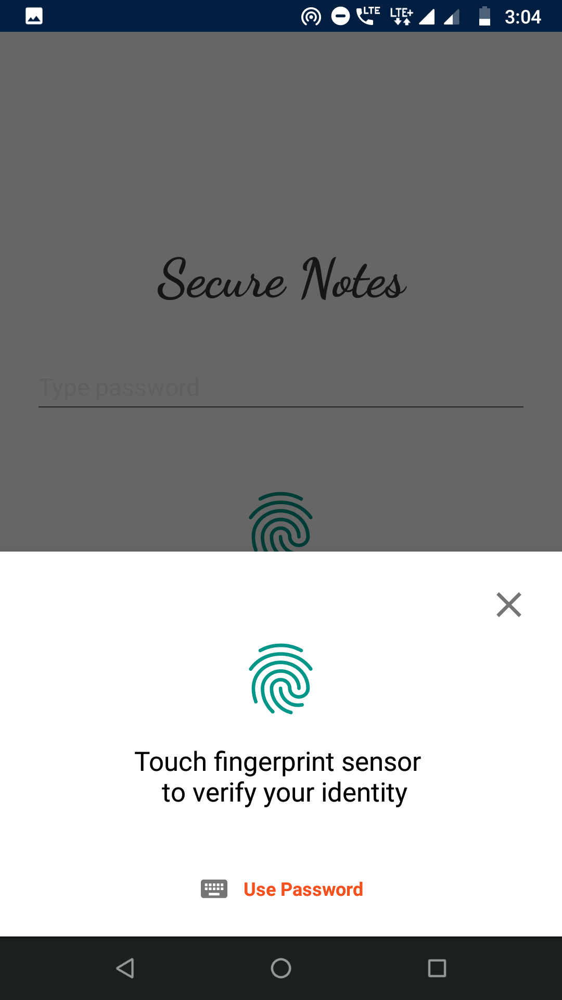
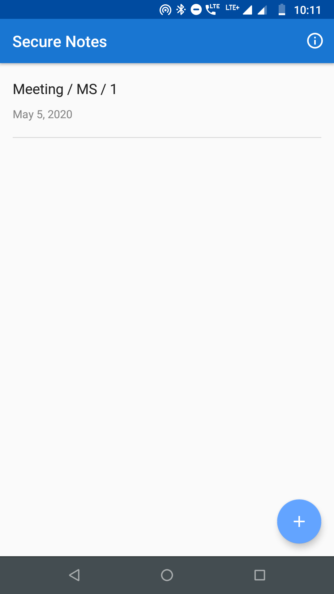
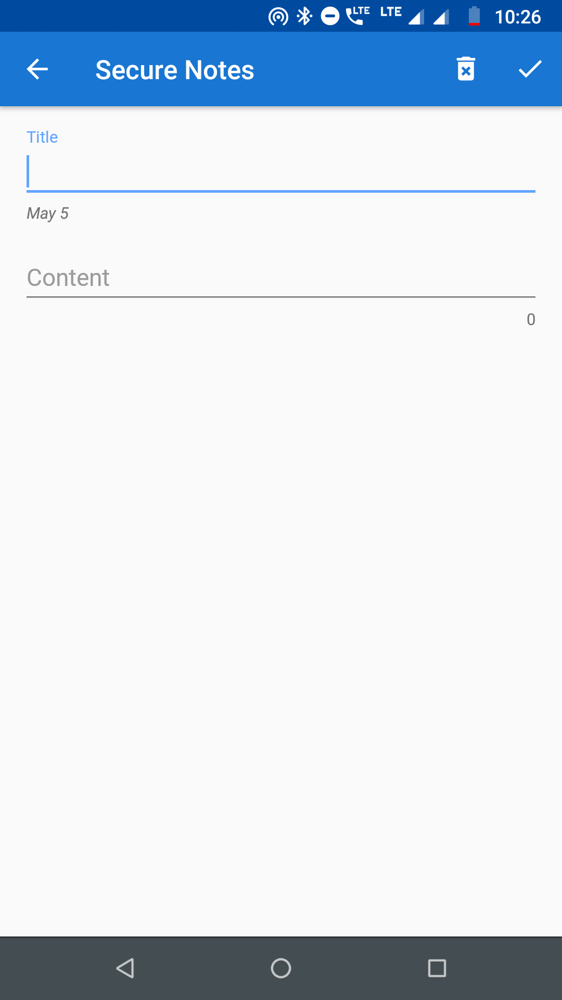
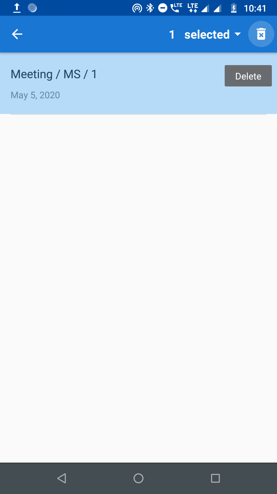
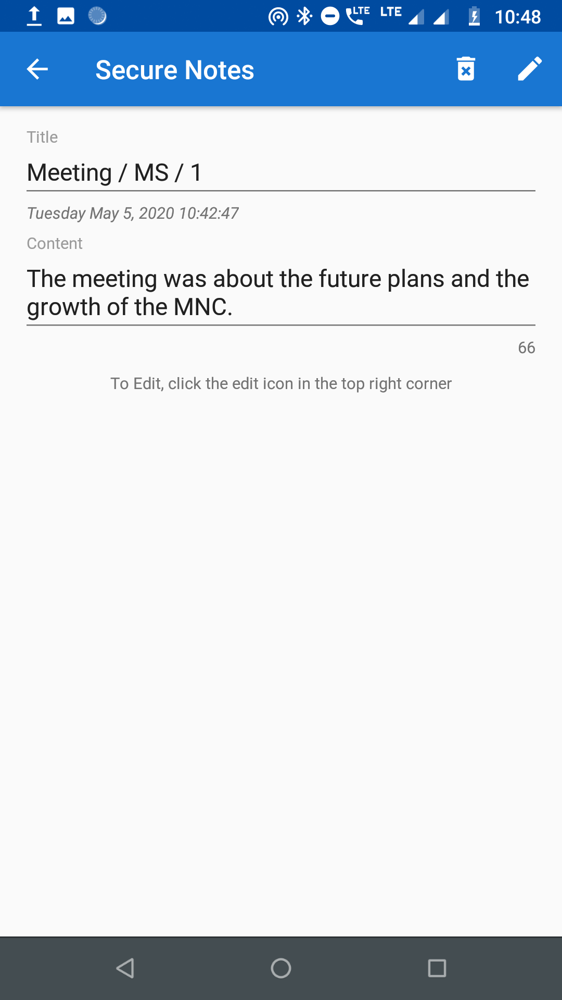
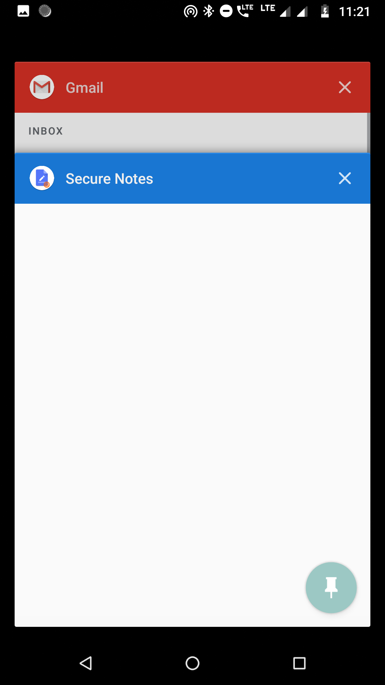

  

# Secure Notes (Fingerprint Authenticated Secure Android Notes)

An App designed for the Computer and Network Security Course Project. It shows the implementation of fingerprint authentication and password protected app.
 

                    

### APK File
- <a href="app/release/app-release.apk">Secure Notes</a>
